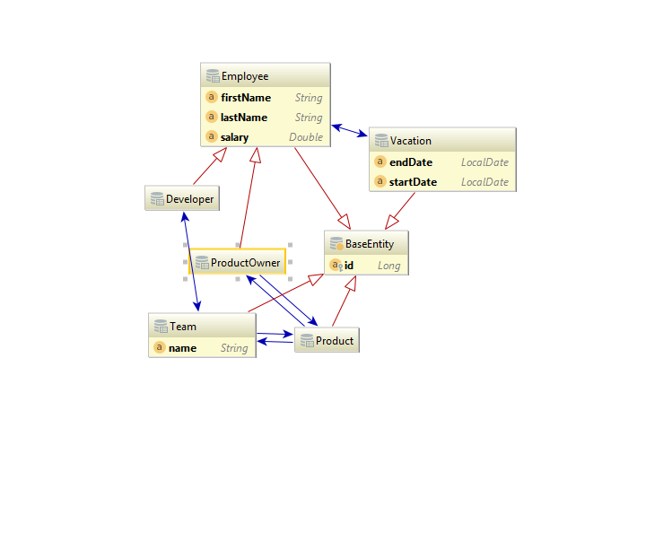

# Tim Untersberger (Mitarbeiterverwaltung)
## ERD

## CLD

## Projekt
In meinem Projekt ist es möglich Daten abzuspeichern wie: "Wem gehört das Produkt?", "Welches Team arbeit an diesem Produkt?", ...

